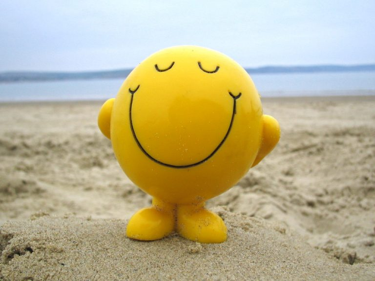

```{r setup, include=FALSE}
knitr::opts_chunk$set(echo = FALSE)
library(tidyverse)
```

```{r titleslide, child="components/titleslide.Rmd"}
```
<!-- DO NOT DELETE -- title slide -->
---
# Background


<br>


.grid[

<div style="font-size:18pt">
<h2>Abstract and Data source</h2>
<p>
<b style="font-size:24pt">Motivations</b><br>
Are you interested in Happiness? The motivation for us to analyse the World Happiness Report is becasue of the deep idea that individuals are able to report their subjective experience in a way which can meaningfully guide individuals and societies towards better lifes. <br>
<br>
<b style="font-size:24pt">Data Source</b><br>
Our Data is gained in the <b>Kaggle</b> with 2015-2022 world happiness report data cotaining factors related to the happiness scores in each country at a worldwide level.  
</p>
</div>




]

---
# Introduction 

__Our research are aim to solve the following questions__


+ The influences of COVID-19 on the world happiness score and correlations between happiness in 2021. 

<br>

+ The changes of happiness between 2015 and 2022 in different regions. 
<br>

+ What is the relationship between economic situation and health status with the happiness. 

<br>

+ In the modelling part, what are the important variables in explaining happiness scores and their performances in linear model. 

---
# Modelling

We will investigating the important variables in explaining the happiness scores via fitting various models including: 

+ Multivariate Model 

+ Support Vector Machine Model 

+ Decision Tree Model 

+ Random Forest Model


---


<!-- DO NOT DELETE -- end slide -->
---
```{r endslide, child="components/endslide.Rmd"}
```


