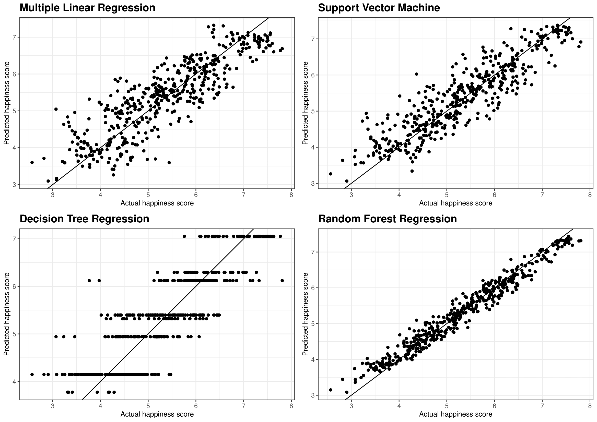

```{r setup, include=FALSE}
knitr::opts_chunk$set(echo = FALSE)
library(tidyverse)
```

```{r titleslide, child="components/titleslide.Rmd"}
```
<!-- DO NOT DELETE -- title slide -->
---
# Background


<br>


.grid[

<div style="font-size:18pt">
<h2>Abstract and Data Source</h2>
<p>
<b style="font-size:24pt">Motivation</b><br>
Do you know what contributes to happiness? Our motivation of analyzing the world happiness index is to determine relevant factors and then try to improve countries' happiness scores based on our results <br>

<br>
<b style="font-size:24pt">Data Source</b><br>
Our data is the 2015-2022 world happiness report obtained from the <b>Kaggle</b> website. It contains factors that are related to the happiness scores in each country at a world wide level.   
</p>
</div>


]

---
# Introduction 

<br>

__Our research aim to solve the following questions__

+ The influences of COVID-19 on the world happiness score and the correlations between happiness in 2021. 

--
+ The changes of happiness between 2015 and 2022 in different regions. 

--
+ The impact of economic situation and the health status on happiness.
--

+ The important variables in explaining happiness scores via different models and their marginal effects in a linear model. 


---
# Exploratory Data Analysis
## How will the happiness change between 2015 and 2022 in different regions?


---
# Exploratory Data Analysis 
## The impact of economic situation and the health status on happiness.


---
# Modelling

We will investigate the important variables in explaining the happiness scores via fitting various models including: 

+ <b>Multivariate Linear Model</b> : Simple Linear regression with multiple variables.

+ <b>Support Vector Machine Model</b>: Supervised Machine learning algorithm to fit regressions. 

+ <b>Decision Tree Model</b>: Binary tree model have control statement. 

+ <b>Random Forest Model</b>: Use multiple learning algorithms (resampling and tree) to give us better results. 


---
# Modelling (Training)

+ <b>Training and Test Split Ratio</b> = 0.4




---
# Modelling (Training)

+ <b>Training and Test Split Ratio</b> = 0.5


---

# Modelling (Training)

+ <b>Training and Test Split Ratio</b> = 0.6


---


# Modelling (Training)

+ <b>Training and Test Split Ratio</b> = 0.7


---

# Modelling (Training)


+ <b>Training and Test Split Ratio</b> = 0.8


---
# Modelling 

__🥳Overall we can see the <b>Random Forest</b> model performs the best of fitting this data. Then we can sort our variables by their importance.__

.grid[

.font_my_2[
<b>Variable importance order</b>

The right table indicates that the most important variables here are the economy (in GDP per capita) and Health. This makes sense because the better economy generally means the higher living standards and social wellbeings. Good health statues ensures higher productivity and the ability to enjoy the life, which will make people feel happy. 

<b>Another Insight</b>

The Random Forest Model has a few limitations. One major limitation is that it cannot provides a better scope on the relationships between variables. For example, marginal effects and percentage changes. 

]


]

---
#Little Improvement 


.grid[

.font_my_2[
<b>New Data For better Analysis</b>

+ Based on the historical data, we found that the fitness of classical linear model is not fitting well. 

+ The current variables in our linear model are have similar coefficients and they all significant. Due to the similar magnitudes in coefficients, we suspect the Happiness Score is simply an average of these factors. Moreover, we also have many different variables in the data set.  

+ To make improvement, we decide to add another two variables we think it's important to contribute the happiness score (Consumer Price Index (CPI) and Population of each country) and combined with the two important variables that we mentioned before. 

]


]


---
# Multivariate Linear model 


+ __To analyse the relationships between these variables, we constructed a <b>Multivariate Linear Model</b> in 2016 to 2020. __


$$\begin{aligned}
log(score)= -4.6000-0.0008\ cpi+0.2591\ log(economy)\\-0.0026\ log(population)+0.0114\ log(health)+0.0032log(year)
\end{aligned}$$


.font_my_2[


+ We then take the logarithm to analyse the percentage change in these variables and eliminate the heteroscedasticity. Then all the coefficients are the percentage change ratio can be written $\frac{\%\Delta Happiness}{\%\Delta Variables}$. 

+ We can see over 2016 to 2020 , a one percent increase in economy will increase the percentage change of happiness score by 25.91%. Then we can also see that the percentage change of health status will also lead a positive increase in happiness score. However, percentage changes on both Consumer Price index and population will lead to a negative percentage change in happiness score. It is make sense that with more people and higher good prices, people will feel stressed on their living conditions. 
]


---
# Multivariate Linear Model

+ __Analysis of Residuals __


.grid[


]


---
# Multivariate Linear Model

+ __Analysis of Residuals__

<br>
<br>


---
# Multivariate Linear Model

__👀 Insights on Our Multivariate Linear Model Model __ 


.grid[


.font_my[


- <b>Limitations of our analysis</b>: 

.font_my_2[

- <b>Endogenous Bias</b>: Another latent variable in the error term still correlate with the variables inside the model, which influence our model's accuracy. 


- <b>Sample Selection Bias</b>: Our data source is not perfect. We only use the most recent data available , which is up to year 2020 data. The world was still experiencing the uncertain impacts of COVID-19 in 2020 at that time. Moreover, the structure of happiness ranks may also change after the pandemic. In terms of NA values, we simply excluded them, which may lead to truncation bias.The exclusion of the subset can influence the statistical significance of the tests, can be biased. 


- <b>Significant Outliers</b>: From the analysis before we can get that there are few significant outliers may also influence the modelling accuracy too.


]

]


]
---
# Conclusion 


---
# Acknowledgement 👨‍💻 
<br>

<br>

<br>


.monash-blue[We would like to gratitude our Lecturer, 

**Patricia Menéndez**, for your patient and selfless guidance.]

<br>

.monash-blue[We would also appreciate our tutor **Naveen** and **Fan** for your coordination along this unit.]


<!-- DO NOT DELETE -- end slide -->
---
```{r endslide, child="components/endslide.Rmd"}
```


