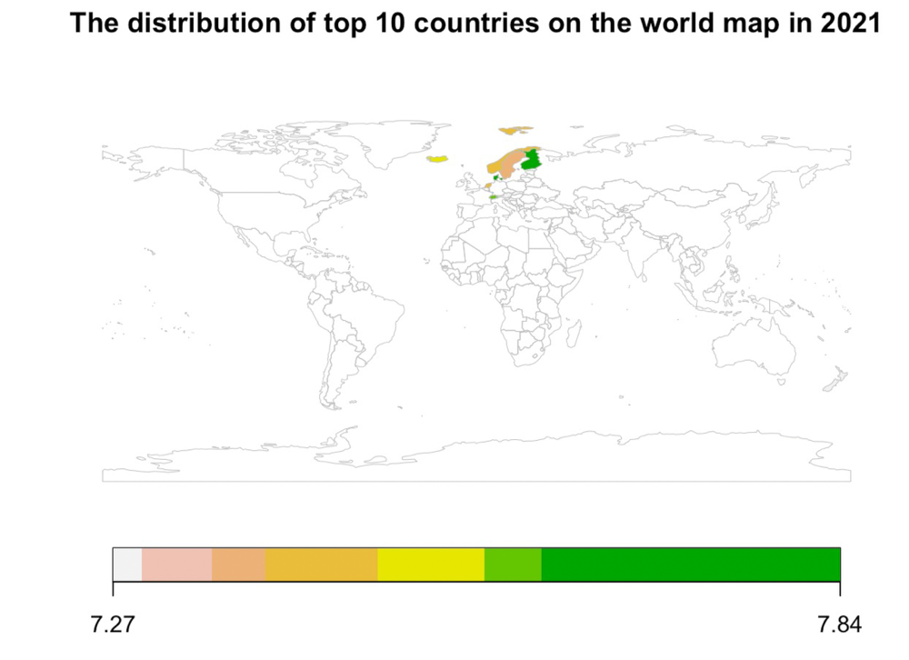
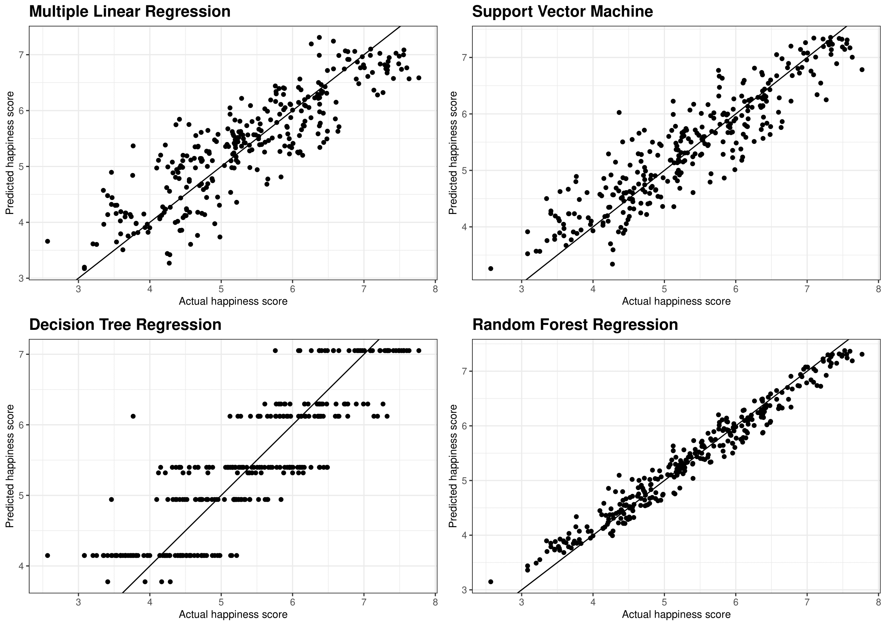

```{r setup, include=FALSE}
knitr::opts_chunk$set(echo = FALSE,warning=FALSE, message=FALSE)
library(tidyverse)
library(ggplot2)
library(dplyr)
library(kableExtra)
library(sf)
library(here)
library(lubridate)
library(cowplot)
library(janitor)
library(maps)
library(plotly)
require(wbstats)
library(RColorBrewer)
library(repr)
library(gridExtra)
library(anicon)
library(rworldmap) 
library(EBImage)
```

```{r titleslide, child="components/titleslide.Rmd"}
```
<!-- DO NOT DELETE -- title slide -->
---
# Background


<br>


.grid[

<div style="font-size:18pt">
<h2>Abstract and Data Source</h2>
<p>
<b style="font-size:24pt">Motivation</b><br>
Do you know what contributes to happiness? Our motivation of analyzing the world happiness index is to determine relevant factors and then try to improve countries' happiness scores based on our results <br>

<br>
<b style="font-size:24pt">Data Source</b><br>
Our data is the 2015-2022 world happiness report obtained from the <b>Kaggle</b> website. It contains factors that are related to the happiness scores in each country at a world wide level.   
</p>
</div>


]

<!-- Remember to delete the above part --EY  -->

---
# Research Aim 

__Our research aim to solve the following questions__

+ The influences of COVID-19 on the world happiness score and the correlations between happiness in 2021. 

--
+ The changes of happiness between 2015 and 2022 in different regions. 

--
+ The impact of economic situation and the health status on happiness.
--

+ The important variables in explaining happiness scores via different models and discover their marginal effects in a linear model. 

---
# Exploratory Data Analysis PART I
## How will happiness trends change between 2015 and 2022 in different regions?


--
.font_my_2[
🧐<u><b>What is the relationship between economic situation and health status with the happiness?</b></u>

]

---
# Exploratory Data Analysis 
#### From 2015 to 2022, What is the relationship between economic situation and health status with the happiness?


---
# Exploratory Data Analysis 
## From 2015 to 2022, What is the relationship between economic situation and health status with the happiness?


--

.font_my_2[

🧐<b>What we can see?</b>

- We can conclude that there is a positive correlation for both economic situation and health status on Happiness score between 2015 and 2022. That is a better economic situation and health status people have, they will feel more happy. 

]

---
# Exploratory Data Analysis Part II
#  Research Question 

-  The top 10 countries in happiness score since COVID-19. 

-  The distribution of the top 10 countries on the world map in 2021. 

-  Relation between happiness score and other 6 attributes in 2021. 

---
class: center
# Exploratory Data Analysis
## The top 10 countries in happiness score since COVID-19


---
class: center
# Exploratory Data Analysis




---
# Exploratory Data Analysis 
## Relation between Happiness score and other indicators in 2021


---
# Modelling

We will investigate the important variables in explaining the happiness scores via fitting various models including: 

+ .font_my_2[<b>Multivariate Linear Model</b> : Simple Linear regression with multiple variables.]

+ .font_my_2[ <b>Support Vector Machine Model</b>: Supervised Machine learning algorithm to fit regressions. ]

+ .font_my_2[ <b>Decision Tree Model</b>: Binary tree model have control statement. ]

+ .font_my_2[ <b>Random Forest Model</b>: Use multiple learning algorithms (resampling and tree) to give us better results. ]


---
# Modelling (Training)

+ <b>Training and Test Split Ratio</b> = 0.4


---
# Modelling (Training)

+ <b>Training and Test Split Ratio</b> = 0.5


---

# Modelling (Training)

+ <b>Training and Test Split Ratio</b> = 0.6




---


# Modelling (Training)

+ <b>Training and Test Split Ratio</b> = 0.7


---

# Modelling (Training)


+ <b>Training and Test Split Ratio</b> = 0.8


---
# Modelling 

__🥳Overall we can see the <b>Random Forest</b> model performs the best of fitting this data. Then we can sort our variables by their importance.__

<br>
.grid[

.font_my[

<b>Variable importance order</b>

The right table indicates that the most important variables here are the economy (in GDP per capita) and Health.

<br>

 
<b><u>Limitation</u></b>: The random forest model cannot provides a better scope on the relationships of variables.

]


]


---
#Little Improvement 
#### To better discover the happiness score, two new variables will be added🥳. 

.grid[

.font_my_2[

+  We cannot tell the order of importance because our target is to improve the happiness index efficiently. 

+ The feeling of Freedom and Generosity is too abstract.

+ People have different standards towards to them. 

+ We build up the model with the Economy, Health, CPI(Consumer Price Index), year, and Population.  

]


]


---
# Multivariate Linear model 


+ __To analyse the relationships between these variables, we constructed a <b>Multivariate Linear Model</b> in 2016 to 2020. __


\begin{align*}
log(score)= -4.6000-0.0008\ cpi+0.2591\ log(economy)\\-0.0026\ log(population)+0.0114\ log(health)+0.0032\ year
\end{align*}


.font_my_2[


+ All the coefficients are the percentage change ratio can be written $\frac{\%\Delta Happiness}{\%\Delta Variables}$. 

+ We can see over 2016 to 2020 , a one percent increase in economy will increase the percentage change of happiness score by 25.91%. 

+ The percentage change of health status will also lead a positive increase in happiness score. 

+ However, percentage changes on both Consumer Price index and population will lead to a negative percentage change in happiness score. 
]


---
# Multivariate Linear Model

+ __Analysis of Residuals __


.grid[


]


---
# Multivariate Linear Model

+ __Analysis of Residuals__

<br>
<br>


---
# Multivariate Linear Model

__👀 Insights on Our Multivariate Linear Model Model __ 


.grid[


.font_my[


 <b>Limitations of our analysis</b>: 

.font_my_2[

- <b>Endogenous Bias</b>: Another latent variable in the error term still correlate with the variables inside the model, which influence our model's accuracy. 


- <b>Sample Selection Bias</b>: 

1. We only use the most recent data available (up to year 2020 data).

2. The structure of happiness ranks may also change after the pandemic. 

3. NAs may lead to truncation bias. 


- <b>Significant Outliers</b>: From the analysis before we can get that there are few significant outliers may also influence the modelling accuracy too.


]

]


]
---
# Conclusion 

__Based on above analysis, we explored few ideas behind the World Happiness Report from 2015 to 2022. Then we can conclude: __

--
.font_my_2[
- Since the outbreak of COVID-19, the countries with highest happiness score are mainly from Northern and Western Europe. Finland has been the happiest country during the COVID-19 period. 
]

--

.font_my_2[

- People living in better economic situations often feel happier and their scores don't change much than those who live in rural areas. Moreover, health status will also help to increase the happiness, no matter where they live. 

]

--

.font_my_2[

- The most important variables to explain the happiness score are the economy situation (measured in GDP per capita) and health statues.

]

--
.font_my_2[

- We discover that two relevant variables (Population, Consumer Price Index) lead to a negative elasticity to the happiness score. 

]

---
class: center
# Collaboration through git  


---
class: center
# Collaboration through git  


---
class:center
# Collaboration through git  


---
# Acknowledgement 👨‍💻 
<br>

<br>

<br>


.monash-blue[We would like to thank our Lecturer, 

**Patricia Menéndez**, for your kind help]

<br>

.monash-blue[We would also appreciate our tutor **Naveen** and **Fan** for your devoted tutoring.]


---
#Online Figure sources 

.monash-blue[

- Big yellow face: [Link](https://www.bayfm.org/news/happiness/) https://www.bayfm.org/news/happiness/

- Human Bowing: [Link](https://psychprofessionals.com.au/happiness/) https://psychprofessionals.com.au/happiness/

- Happy Figers: [Link](https://scdcentre.com/the-psychology-of-happiness/) https://scdcentre.com/the-psychology-of-happiness/

]
<!-- DO NOT DELETE -- end slide -->
---
```{r endslide, child="components/endslide.Rmd"}
```


